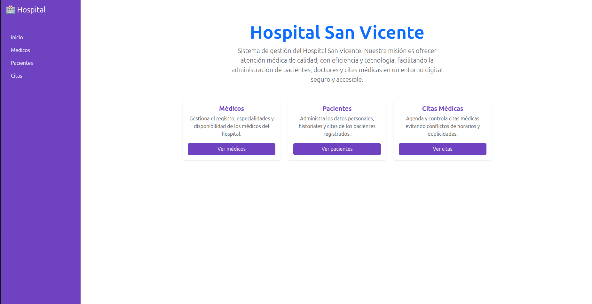
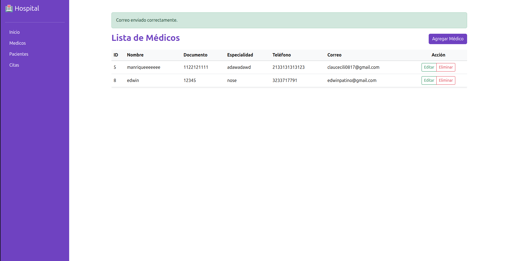
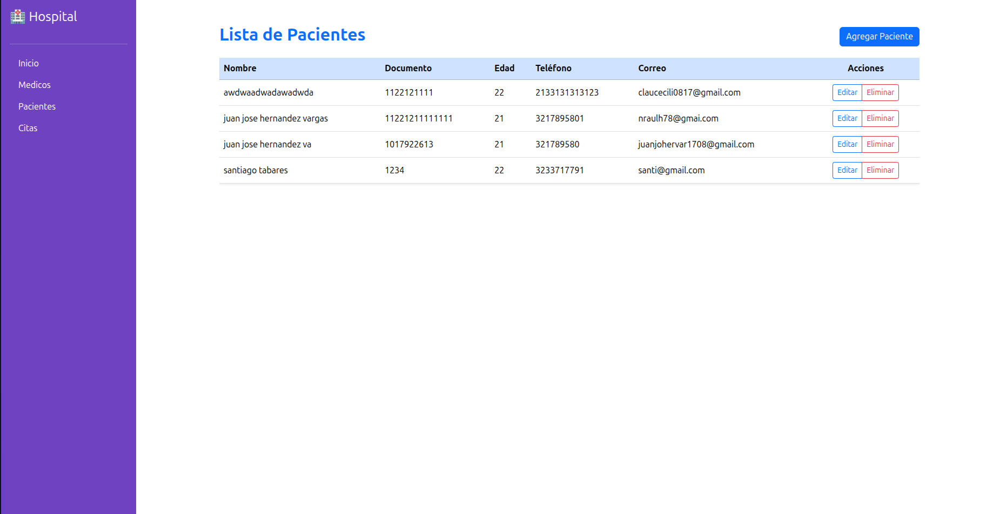
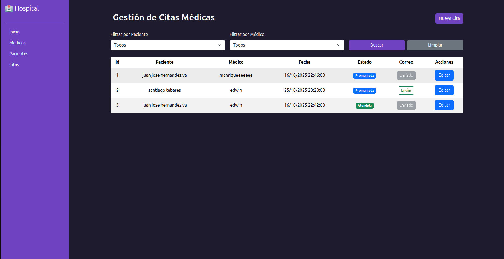

README — Sistema de Gestión de Citas
Juan Jose Hernandez Vargas
Clan: Van Rossum (c#)
Correo: juanjohervar1708@gmail.com  
CC: 1017922613

===============================================================
REPRESENTACION DE LAS ENTIDADES
===============================================================

===============================================================
RESUMEN
===============================================================
Pequeña aplicación ASP.NET MVC para la gestión de citas médicas con:
- CRUD básico para Pacientes, Doctores y Citas.
- Envío de correo de confirmación por cita y registro en EmailLogs.
- Interfaz con Bootstrap y estilo morados y azules.

===============================================================
ESTRUCTURA DEL PROYECTO
===============================================================
- Controllers/
    - AppointmentController
    - PatientController
    - DoctorController
    - HomeController
- Data/
    - MySqlContext.cs
- Models/
    - Appointment
    - Patient
    - Doctor
    - EmailLog
    - AppointmentStatus
    - EmailStatus
- Views/
    - Appointment
    - Patient
    - Doctor
    - Shared
- Program.cs
- appsettings.json

===============================================================
REQUISITOS
===============================================================
- .NET SDK 8
- Base de datos MySQL 
- EF Core CLI (dotnet ef)

===============================================================
CONFIGURACIÓN
===============================================================
1. En appsettings.json:
   "ConnectionStrings": {
   "DefaultConnection": "server=localhost;port=3306;database=tu_db;user=tu_usuario;password=tu_contraseña"
   }

2. Ejecutar migraciones:
   dotnet ef database update

===============================================================
SMTP Y ENVÍO DE CORREOS
===============================================================
Método SendEmail(int appointmentId) en AppointmentController:
- Recupera la cita con Include(Patient, Doctor)
- Envía el correo vía SMTP
- Registra EmailLog con estado Sent o NotSent

===============================================================
INTERFAZ INDEX CITAS
===============================================================
Se muestra una tabla con todas las citas.
Botón Enviar cambia a Enviado si ya se envió el correo para cada una de las citas.
Permite editar las citas.

===============================================================
EJECUCIÓN
===============================================================
1. dotnet run 
2. Abrir https://localhost:5001/Appointment/Index
3. 
4. Navegamos las diferentes opciones que hay en el Menu lateral
5. 
6. 
7. 

===============================================================
PROBLEMAS FRECUENTES
===============================================================
- InvalidCastException: verificar que Status sea VARCHAR.
- No se envía correo: revisar host, puerto, credenciales o firewall.
- Botón Enviar no cambia.

===============================================================
HECHO POR JUAN JOSE HERNANDEZ VARGAS
===============================================================
Desarrollo de prueba modulo 5 — Juan José Vargas